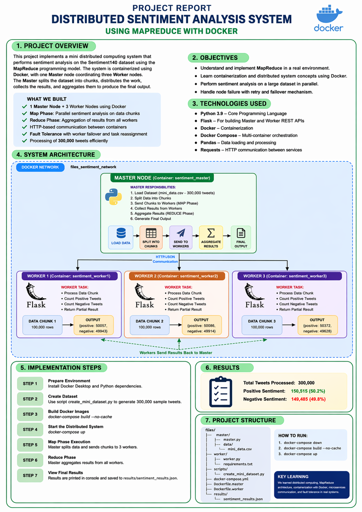

# 🚀 **Distributed Sentiment Analysis System using Docker**

---

## 📌 **Project Overview**

This project implements a **Distributed Sentiment Analysis System** using a **Master–Worker Architecture** 🧠⚡

The system is designed to process large datasets efficiently by distributing tasks among multiple worker nodes.

👉 The **Master Node** divides the dataset into chunks and assigns them to workers
👉 Each **Worker Node** processes its assigned data and returns results

---

## 🎯 **Objectives**

✨ Implement distributed computing using Docker
✨ Perform sentiment analysis on text data
✨ Simulate worker node failure ⚠️
✨ Ensure task reassignment & fault tolerance 🔁
✨ Demonstrate parallel processing 🚀

---

## 🏗️ **System Architecture**



### 🔹 **Components**

### 🧠 **Master Node**

* Controls the system
* Splits dataset into chunks
* Assigns tasks to workers
* Collects and combines results

### ⚙️ **Worker Nodes (Worker1, Worker2, Worker3)**

* Receive tasks from master
* Perform sentiment analysis
* Return processed results

### 🐳 **Docker Compose**

* Manages all containers
* Runs multiple services simultaneously

---

## ⚙️ **Technologies Used**

* 🐍 **Python**
* 🐳 **Docker & Docker Compose**
* 🌐 **Flask (API Communication)**
* 🤖 **Natural Language Processing (NLP)**

---

## 📂 **Project Structure**

```
.
├── master/
│   ├── master.py
│   ├── data/
│   └── results/
├── worker/
│   ├── worker.py
│   └── requirements.txt
├── scripts/
│   └── create_mini_dataset.py
├── Dockerfile.master
├── Dockerfile.worker
├── docker-compose.yml
└── README.md
```

---

## 🔄 **Workflow**

1️⃣ Master loads dataset
2️⃣ Dataset is split into chunks
3️⃣ Tasks assigned to worker nodes
4️⃣ Workers perform sentiment analysis
5️⃣ Results sent back to master
6️⃣ Master combines final output

---

## 🧪 **Fault Tolerance (Key Feature ⚡)**

This system includes:

✔ Worker failure simulation
✔ Task reassignment
✔ Continuous processing even if one worker fails

💡 **Example:**
If **Worker 3 fails ❌** → tasks are automatically reassigned to **Worker 1 & Worker 2 ✅**

---

## 🚀 **How to Run the Project**

### 🔹 Step 1: Build Containers

```bash
docker-compose build
```

### 🔹 Step 2: Run System

```bash
docker-compose up
```

### 🔹 Step 3: Stop System

```bash
docker-compose down
```

---

## 📊 **Output**

📁 Results are stored in:

```
master/results/sentiment_results.json
```

📌 Output includes:

* 😊 Positive sentiment
* 😐 Neutral sentiment
* 😡 Negative sentiment

---

## 🖼️ **Screenshots / Results**

### 🔹 System Output


📸 You can also add:

* Docker running containers screenshot
  

* 

* Terminal output
* 


---

## 📈 **Key Features**

✔ Distributed Processing ⚡
✔ Parallel Execution 🚀
✔ Fault Tolerance 🔁
✔ Dockerized Architecture 🐳
✔ Scalable Design 📈

---

## ❗ **Challenges Faced**

⚠️ Docker connection issues
⚠️ Worker failure handling
⚠️ Inter-container communication
⚠️ Large file handling (GitHub limits)

---

## ✅ **Conclusion**

This project demonstrates how **distributed systems** improve performance and reliability using Docker 🐳

It showcases real-world concepts like:
✔ Load balancing
✔ Fault tolerance
✔ Parallel processing

---

## 👨‍💻 **Author**

**Mudassar**
🚀 Flutter Developer
🤖 Machine Learning Enthusiast

---

## 🔗 **GitHub Repository**

👉 https://github.com/mudassar2224/BIG_DATA_DOCKER_ASSGINMENT_03

---

#
